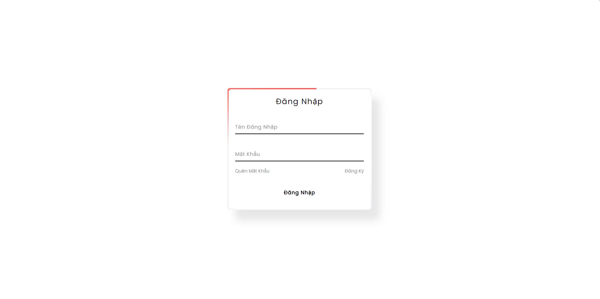

# Quản Lý Cửa Hàng Giày


## Mục Lục

- [Giới Thiệu](#giới-thiệu)
- [Tính Năng](#tính-năng)
- [Công Cụ Sử Dụng](#công-cụ-sử-dụng)
- [Ngôn Ngữ Sử Dụng](#ngôn-ngữ-sử-dụng)
- [Cài Đặt](#cài-đặt)
- [Chạy Ứng Dụng](#chạy-ứng-dụng)
- [Hình Ảnh Demo](#hình-ảnh-demo)
- [Liên Hệ](#liên-hệ)

## Giới Thiệu

Quản Lý Cửa Hàng Giày là một ứng dụng web được phát triển để quản lý toàn bộ hoạt động của cửa hàng giày, bao gồm quản lý sản phẩm, người dùng, khách hàng và hóa đơn. Ứng dụng cung cấp giao diện thân thiện và các chức năng mạnh mẽ giúp quản lý hiệu quả và tiết kiệm thời gian.

## Tính Năng

### 1. Quản Lý Sản Phẩm

- **Thêm Sản Phẩm**: Thêm mới các sản phẩm giày vào hệ thống với thông tin chi tiết như tên, danh mục và mô tả.
- **Sửa Sửa Sản Phẩm**: Chỉnh sửa thông tin sản phẩm hiện có.
- **Xóa Sản Phẩm**: Xóa sản phẩm không còn kinh doanh, đảm bảo không có liên kết với hóa đơn hoặc phiên bản sản phẩm.
- **Tìm Kiếm Sản Phẩm**: Tìm kiếm sản phẩm theo mã hoặc tên.
- **Xem Chi Tiết Sản Phẩm**: Xem thông tin chi tiết của sản phẩm cùng với các phiên bản liên quan (màu sắc, kích cỡ, giá, số lượng tồn kho).
- **Quản Lý Phiên Bản Sản Phẩm**: Thêm, sửa, xóa các phiên bản sản phẩm để theo dõi đa dạng các tùy chọn sản phẩm.

### 2. Quản Lý Người Dùng

- **Thêm Người Dùng**: Thêm mới tài khoản người dùng với tên đăng nhập, mật khẩu và vai trò (admin hoặc nhân viên).
- **Sửa Người Dùng**: Chỉnh sửa thông tin người dùng, bao gồm cập nhật mật khẩu và vai trò.
- **Xóa Người Dùng**: Xóa tài khoản người dùng không còn hoạt động, đảm bảo không có liên kết với hóa đơn.
- **Tìm Kiếm Người Dùng**: Tìm kiếm người dùng theo tên đăng nhập hoặc vai trò.
- **Liệt Kê Người Dùng**: Hiển thị danh sách tất cả người dùng hiện có trong hệ thống.

### 3. Quản Lý Hóa Đơn

- **Tạo Hóa Đơn**: Tạo mới hóa đơn cho khách hàng với thông tin chi tiết về sản phẩm đã mua.
- **Xem Chi Tiết Hóa Đơn**: Xem thông tin chi tiết của mỗi hóa đơn, bao gồm danh sách sản phẩm, số lượng, giá và tổng tiền.
- **Quản Lý Khách Hàng**: Thêm, sửa, xóa thông tin khách hàng liên quan đến hóa đơn.

## Công Cụ Sử Dụng

- **Visual Studio Code (VSCode)**: Mã nguồn được phát triển và chỉnh sửa bằng VSCode.
- **XAMPP**: Môi trường phát triển PHP và MySQL được thiết lập sử dụng XAMPP.

## Ngôn Ngữ Sử Dụng

- **PHP**: Xử lý phía máy chủ và kết nối cơ sở dữ liệu.
- **HTML/CSS**: Tạo giao diện người dùng.
- **JavaScript (jQuery)**: Tương tác người dùng và xử lý AJAX.
- **SQL**: Quản lý và truy vấn cơ sở dữ liệu MySQL.

## Cài Đặt

### Yêu Cầu Hệ Thống

- **Hệ Điều Hành**: Windows, macOS hoặc Linux.
- **Phần Mềm**:
  - [XAMPP](https://www.apachefriends.org/index.html) (bao gồm Apache, MySQL, PHP)
  - **Trình Duyệt Web**: Chrome, Firefox, hoặc bất kỳ trình duyệt hiện đại nào khác.

### Bước 1: Tải và Cài Đặt XAMPP

1. Tải [XAMPP](https://www.apachefriends.org/index.html) từ trang chính thức.
2. Cài đặt XAMPP theo hướng dẫn trên màn hình.
3. Khởi động Apache và MySQL từ bảng điều khiển XAMPP.

### Bước 2: Thiết Lập Cơ Sở Dữ Liệu

1. Mở trình duyệt và truy cập `http://localhost/phpmyadmin/`.
2. Tạo một cơ sở dữ liệu mới tên là `quan_ly_cua_hang_giay`.
3. Nhập file SQL `database_dump.sql` (có thể lấy từ thư mục dự án) vào phpMyAdmin để tạo các bảng và cấu trúc cơ sở dữ liệu.

### Bước 3: Tải Mã Nguồn

1. Tải mã nguồn dự án về máy tính của bạn.
2. Sao chép thư mục dự án vào thư mục `htdocs` của XAMPP (thường nằm tại `C:\xampp\htdocs\` trên Windows hoặc `/Applications/XAMPP/htdocs/` trên macOS).

### Bước 4: Cấu Hình Kết Nối Cơ Sở Dữ Liệu

1. Mở tệp `database.php` nằm trong thư mục `config`.
2. Cập nhật các thông tin kết nối cơ sở dữ liệu (nếu cần):

    ```php
    <?php
    $host = 'localhost';
    $db   = 'quan_ly_cua_hang_giay';
    $user = 'root';
    $pass = '';
    $charset = 'utf8mb4';

    $dsn = "mysql:host=$host;dbname=$db;charset=$charset";
    $options = [
        PDO::ATTR_ERRMODE            => PDO::ERRMODE_EXCEPTION,
        PDO::ATTR_DEFAULT_FETCH_MODE => PDO::FETCH_ASSOC,
        PDO::ATTR_EMULATE_PREPARES   => false,
    ];
    try {
         $conn = new PDO($dsn, $user, $pass, $options);
    } catch (\PDOException $e) {
         throw new \PDOException($e->getMessage(), (int)$e->getCode());
    }
    ?>
    ```

## Chạy Ứng Dụng

1. Mở trình duyệt và truy cập `http://localhost/ten_thu_muc_du_an/` (thay `ten_thu_muc_du_an` bằng tên thư mục dự án bạn đã sao chép vào `htdocs`).
2. Đăng nhập bằng tài khoản admin đã được thêm vào cơ sở dữ liệu.
3. Bắt đầu sử dụng các chức năng quản lý sản phẩm, người dùng, khách hàng và hóa đơn.

## Hình Ảnh Demo

### 1. Giao Diện Đăng Nhập



### 2. Dashboard Chính


### 3. Quản Lý Sản Phẩm


### 4. Quản Lý Người Dùng


### 5. Quản Lý Hóa Đơn


## Liên Hệ

Nếu bạn gặp bất kỳ vấn đề nào hoặc có câu hỏi về dự án, vui lòng liên hệ:

- **Email**: khanhaovl18@gmail.com
- **Facebook**: https://www.facebook.com/NgoDuyKhanhvip/
- **Số Điện Thoại**: 0969646084; zalo: 0582404801

---

© 2024 Cửa Hàng Giày. Đã đăng ký.
